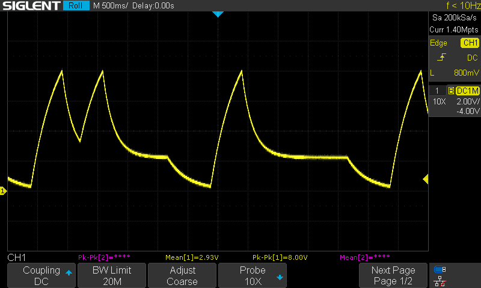

# Assembly Guide

## SMT Components

If manually placing SMT components, use of a stencil and solder paste is recommended. 

1. D11 and D12
2. R33 and R34 (ferrite beads)
3. remaining SMT diodes D1-D9 (D3 does not exist)
4. Q8 (2N7002K NMOSFET)
5. remaining BJTs (Q1-Q7, Q9)
6. ICs U1-U4
7. Tantalum capacitors C2 and C8
8. Ceramic capacitors C3, C1, C4-C7, C9-C14, C17
8. Resistors R1-R32

## THT Components

Once all SMT components are placed, solder THT components

### Front Side

1. C15 and C16
2. SW1 (push button)
3. J1-J3
4. RV1-RV5 (note values *and* taper)
5. SW2

Place and solder the 3mm LED once the faceplate is fitted.

### Back Side

1. J4 (IDC header)

## Test and Calibration

No calibration required. To test, 

1. connect the envelope output to an oscilloscope (use 'roll' mode to capture at 500ms/div+)
2. use the manual gate to trigger an envelope (adjust controls, observe response)
3. switch to loop mode and confirm repeated envelopes
4. apply an additional gate input to the trigger input to check that the AD/R can be triggered independently.

The screenshot below shows the ADSR EG in loop mode with an extra trigger pulse applied during the envelope sequence.

{: width="800"}

## BOM

[Download (.csv)](assets/bom.csv)


