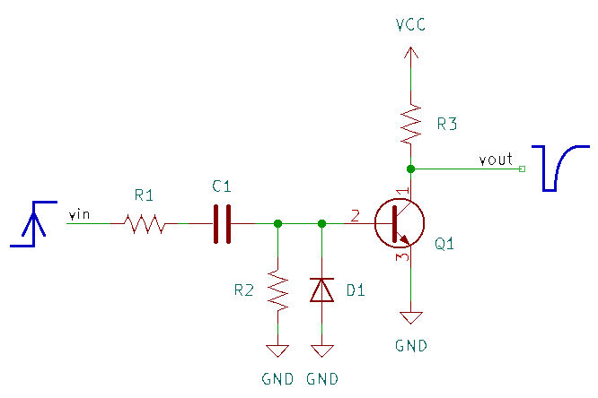
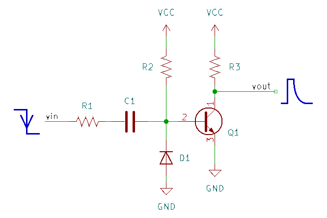
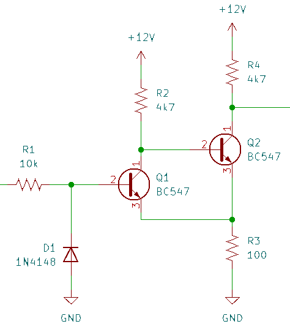
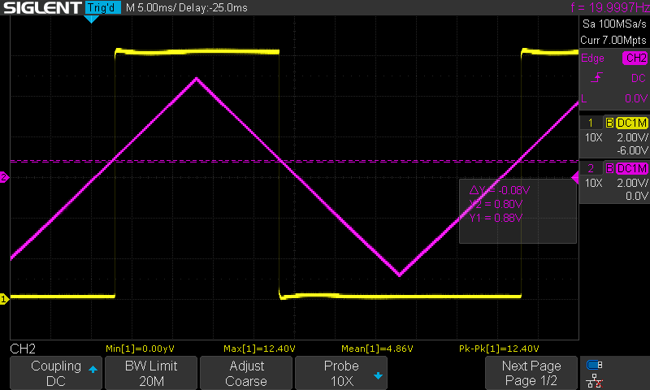
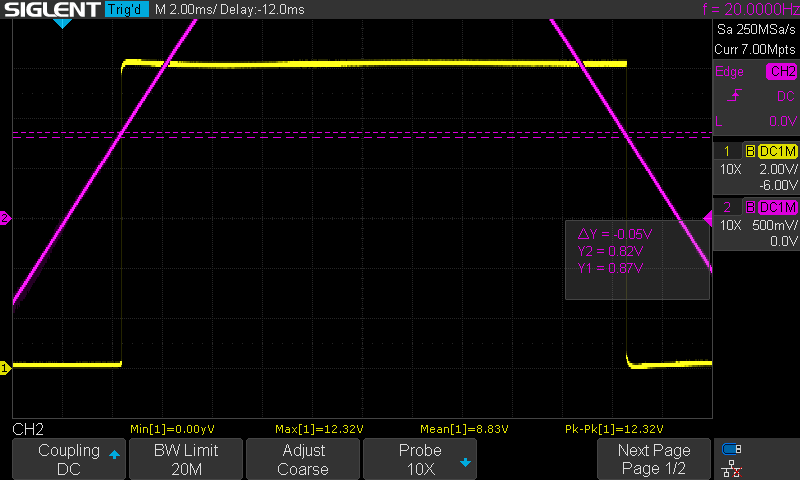
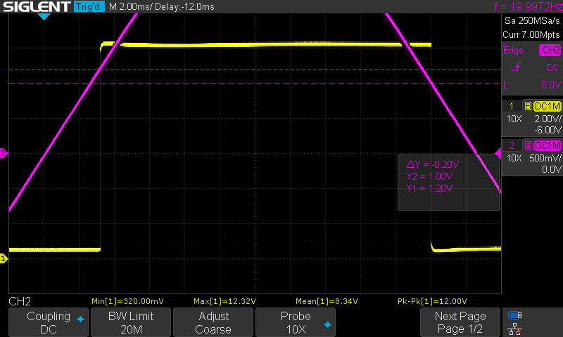

# Buffers and Pulse Generators

## Overview

The ADSR uses multiple BJT-based buffers, invereters, and pulse generators to condition signals and drive the sequential logic of the envelope. This section details the designs of those circuits.

## References

1.  Rene Schmitz, "Third ADSR Schematic", [[schmitzbits.de](https://schmitzbits.de/adsr.html)]
2.  P.  Horowitz and W. Hill, *The Art of Electronics*, 3rd ed.,  Cambridge University Press (2016)
3.  Kassutronics, "Precision ADSR", [[kassu2000.blogspot.com](https://kassu2000.blogspot.com/2015/05/precision-adsr.html)]
4.  Eddy Bergman, "Synthesizer Build part-67: KASSUTRONICS PRECISION ADSR," [[eddybergman.com](https://www.eddybergman.com/2025/04/Kassutronic-precision-adsr.html)]

## Edge-Triggered Pulse Generators

Both rising and falling edge-triggered pulses are required. In each case, the output pulse should be inverted: the trigger of the 555 and the inputs to the SR-latch are active low. 

Edge-triggered pulse generating circuits are described in section 7.2.1 of [2]. With a single BJT, a rising edge can be converted to an inverted pulse with span $T \simeq R_1 C_1$ using the circuit below ($R_2 \gg R_1$). The diode D1 protects against reverse-bias breakdown of the base-emitter junction. 

{: width="320"}

Rising edge inverted pulse generators are used at the trigger input and to generate the trigger pulse to the 555 from the buffered gate input. In the first case, the output impedance of the source (typically $1k\Omega$) is used for $R_1$. In the second case, $C_1$ is charged through the bias resistor to the collector at the output of the buffer. 

The inverted pulse generated from the trigger input sets the SR latch. Both inverted pulses trigger the 555 through a diode-OR. 

The falling edge pulse generator creates a non-inverted pulse with span $T\simeq R_2 C_1$ with $R_2 \gg R_1$. 

{: width="320"}

To create an inverted pulse from a negative edge, a second inverting stage is added to the buffer. Adding an common emitter resistor creates some hysteresis, which results in a clean inverted pulse. This configuration is used for the reset signal to the SR latch from the falling edge of the 555 output. 

## Buffers 

Both the gate input and the falling-edge reset pulse are passed through a buffer. 
In the schmitzbits.de design [1], the input is passed through two cascaded BJT inverters, with an optional feedback resistor to increase sensitivity for slowly varying inputs. I experimented with an alternative Schmitt trigger buffer
(Section 2.2 in ref. 2):

{: width="320"}

The buffer has a rising edge threshold of approximately
$V_{be} + \Delta V$, where $\Delta V \equiv R_3/R_4 V_{CC}$. When
$R_3 = 22$, $\Delta V \approx 50\mathrm{mV}$, and
$\Delta V \approx 200\mathrm{mV}$ for $R_3 = 100$. The low output will
also have an offset of approximately $V_{CE,sat} + \Delta V$, where
$V_{CE,sat} \approx 100\mathrm{mV}$.

R3 (Ω)                 |ΔV (mV)                |Rising threshold (V)
-----------------------|-----------------------|-----------------------
22                     |50                     |0.85
100                    |200                    |1.1

A circuit simulation can be found on [falstad.com](https://tinyurl.com/26fdct39).

In the Kassutronics [precision ADSR](https://kassu2000.blogspot.com/2015/05/precision-adsr.html) design, this input buffer is used with a larger $R_4=22k\Omega$ and smaller $R_3 = 10\Omega$, which yields $\Delta V\approx 5\mathrm{mV}$. The larger emitter resistor reduces the current consumption in this buffer significantly. The diode at the base of the input BJT guards against the reverse-bias breakdown of the base-emitter diode. An extra shunt resistance to ground at the base avoids a floating base (not shown in the schematic above).

These Schmitt-trigger buffers are used to condition the gate input to the ADSR and to buffer the falling edge-generated pulse from the 555 output to reset the SR latch. 

## Testing

To check the circuit, I applied a 10Vpp triangle wave (centered at 0V)
and varied R3.

{: width="800"}

With R3=22, $V_{th,R} = 0.87$ V, $V_{th,F} = 0.82$ V, $\Delta V = 50$
mV, and the low-level output is approximately 150mV.

{: width="800"}

With R3=100, $V_{th,R} = 1.2$ V, $V_{th,F} = 1.0$ V, $\Delta V = 200$
mV, and the low-level output is approximately 350mV.

{: width="800"}

## Notes

I originally started investigating this due to an inherent limitation in the earlier
verions of this ADSR circuit: the low-level (OFF) voltage is still 200-300mV. The
release path decays to this level, which creates a long tail on the envelope and holds the output of the envelope at that level. 

For example, in Rene Schmitz's design, the low output is pulled down to the $V_{CE,sat.}$ of the output transistor in the buffer, which should be 50-80mV. This is
similar to what you\'d expect for a rail-to-rail comparator (e.g.
[TLV360x](https://www.ti.com/lit/ds/symlink/tlv3601.pdf)), but the level
is still held up by the very small current though the small-signal diode.

Eddy Bergman points this out in [his implementation](https://www.eddybergman.com/2025/04/Kassutronic-precision-adsr.html), which is one of the only references that
I found that highlights this issue. It's fixed with the "[precision diodes](https://en.wikipedia.org/wiki/Precision_rectifier)" in the [Kassutronics version](https://kassu2000.blogspot.com/2015/05/precision-adsr.html), which is very nice. 

I also found that the buffer used in Rene Schmitz's design is prone to latching up. This may be due to the feedback resistor and lack of a shunt resistor to ground at the input base. I wasn't able to reproduce this in simulation (untested idea: the beta of the BJT is larger in practice than in the model), but adding a 100k shunt to ground fixed it. In the Kassutronics circuit, the Schmitt-trigger buffer is used (with a $10\Omega$ resistor from the emitter to ground) and I followed that approach in my final design.
