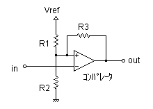
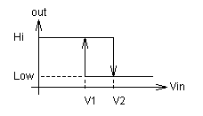

# Loop Feedback Comparator

## References

1.  "Inverting Comparator with Hystersis Circuit", app. note, Texas Instruments
    \[[ti.com](https://www.ti.com/lit/ab/snoa997a/snoa997a.pdf)\] (2019)
2.  "Comparator circuits with Hystersis Design Tool", Okawa Electric
    Design, online
    \[[okawa-denshi.jp](http://sim.okawa-denshi.jp/en/compkeisan.htm)\]

## Design

The objective of the comparator in the feedback loop is to re-trigger
the 555 one-shot when the output envelope drops below a threshold. The comparator will be constructed with an opamp in TL07x, which results in outputs ranging from approximately -11V to 11V. The 555 only accepts inputs from 0 to VCC, and the trigger input on the 555 is active-low: a BJT common-emitter inverter will handle the level translation.

With the BJT inverter, we need an inverting comparator to trigger
(active-low) the 555 on the falling edge of the envelope. When the
envelope rises again, the trigger is removed from the 555 (which holds its output based on the RC time constant).

  

  

Using the calculator in \[2\] with

-   $V_{ref} = 12V$
-   $V_1 = 0.2V$
-   $V_2 = 0.6V$
-   $V_{o,hi} = 11V$
-   $V_{o,lo} = -11V$

the resistor values are (original values were approximately 1/4 of these
values & all were increased by a factor of about 4 to reduce current
consumption):

-   $R_1 = 120k\Omega$
-   $R_2 = 4.7k\Omega$
-   $R_3 = 270k\Omega$

In the [falstad.com](https://tinyurl.com/27wtkzdx) simulation,
$V_1 = 0.26V$ and $V_2 = 0.64V$.

Alternative (V1=0.15, V2=0.3):

-   $R_1 = 150k\Omega$
-   $R_2 = 2.7k\Omega$
-   $R_3 = 330k\Omega$
