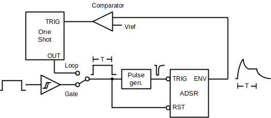

# Overview

The module is designed around the 555-core ADSR. 

{: width="640"}

The input to the ADSR core is a logic-high pulse with length $T$. The rising edge of this pulse is converted to a short, inverted trigger to start the envelope. The pulse itself also holds the (active-low) reset high, which generates the window for the attack, decay & sustain phases. When the gate pulse is removed, the release phase is triggered. 

When the external gate is selected, a Schmitt-trigger buffer converts the input signal into a pulse. Alternatively, the EG can be switched into a looping mode: a comparator detects the end of the envelope (release decays below ~100mV) and triggers a one-shot, which provides an adjustable-length gate pulse.

## Notes on Features

### Off State

The original variants don't really decay back to 0V in the off state. Between the small signal diodes and the VCE of the input buffer, I could only get it to about 200mV. The only discussion I found on this was on Eddy Bergman's site (thank you), and is resolved with precision diode implementation in the Kassutronics version (very clever). Eddy Bergman came up with a partial fix by switching to Schottky diodes, which could be used to free up another opamp, but concludes that the precision diode version (Kassutronics) is better. 

### The Extra Opamp

Rene Schmitz's version uses two OPAs (nicely satisfied with a TL072). Later designs (YuSynth+) added an inverting output (also nicely featured in Moritz Klein's non-555 version), but that leaves one more...

  * Blink an LED (YuSynth, Kassutronics). In my opinion, better replaced with a BJT (see Moritz Klein's version), but the Kassutronics version neatly combines the inverting and blinking and uses the other for the precision diode.
  * Loop trigger (Moritz Klein). In combination with the precision diode for the release path, I had to give up the inverting output.
  * Inverted output. This comes in a few forms, but the attenuverter stage is probably the most flexible. I liked the way that Moritz Klein did it with the offset, giving an inverted control signal, e.g. for a "normally open" filter.

More details for the [Loop Comparator](loop_comparator.md) can be found on that page.

### Decay vs. Release

When the gate is removed before the decay completes, Yves Usson added a MOSFET to force the capacitor to discharge through the release path. Fancy.

### Various Input Stages

Generally, a combination of Schmitt-trigger buffer and glitch generator are used, but the details change from design to design. I tried a classic Schmitt trigger (see Kassutronics or YuSynth), but was concerned that it would hold up the off-state voltage (before I found the precision diode design) and went back to Rene Schmitz's buffer. More detailed design notes for the [Input Buffer](input_buffer.md) are found on that page. 

### Manual Gate

This is an easy addition, see e.g. Kassutronics.

### (Re-)Triggering

There's some discussion about how no true ~~Scotsman~~ musician could do without a re-triggerable ADSR. This make some sense for pianos (think "sustain pedal").

## Other Variants

There are some other interesting design ideas out there that I found while investigating the design of this ADSR.

### Befaco VC ADSR

* [befaco.org](https://www.befaco.org/vc-adsr/)
* Discrete logic based ADSR sequence (latches & flip-flops)
* voltage control on all stages
* switch between gate and trigger mode
* shape-controllable between exponential and linear rise and fall.

### MFOS (Ray Wilson) ADSR Envelope Generator

* [musicfromouterspace.com](https://musicfromouterspace.com/analogsynth_new/ADSR001/ADSR001.html)
* discrete logic based ADSR sequence (latches)
* re-triggerable A+D/R
