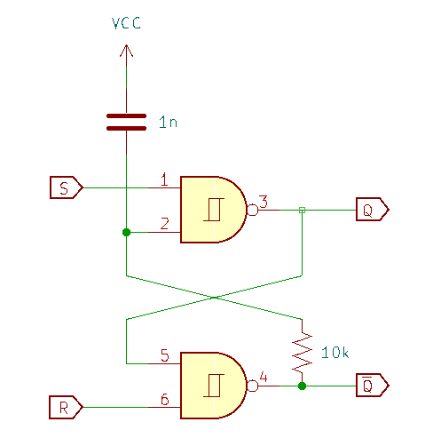
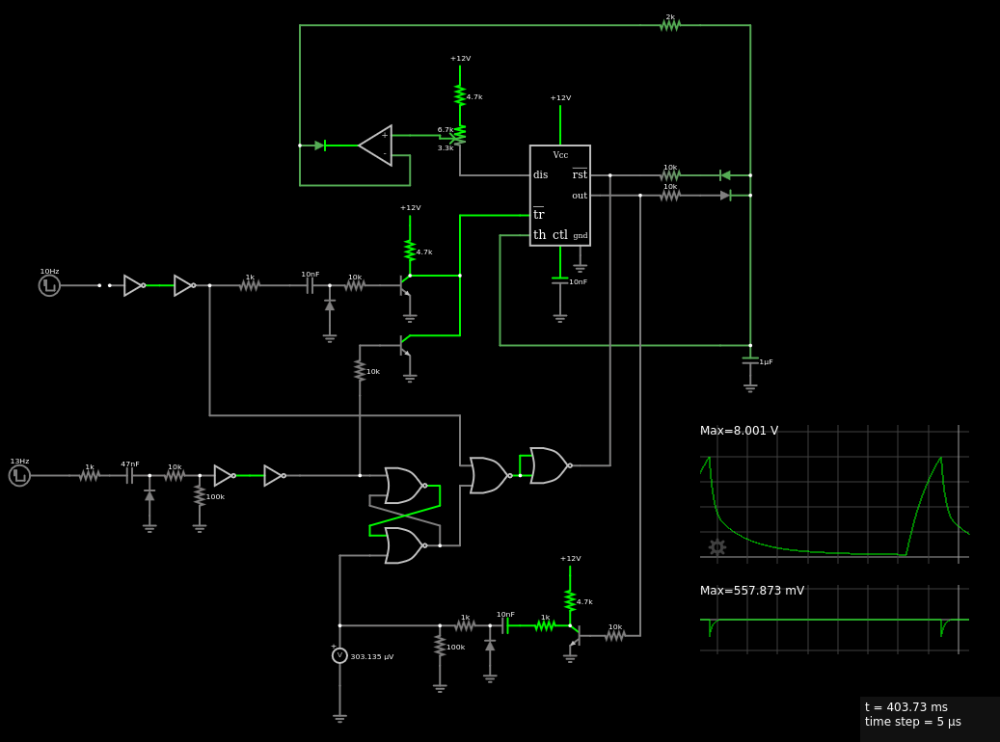

# Trigger Input

## Overview

The trigger input should

* detect the rising edge and ignore the input pulse duration (assume a reasonably square pulse)
* initiate a complete attack phase (envelope goes to max)
* work at any stage in the envelope (independent of gate control signal)

In the context of the 555-core EG, this requires

* apply an inverted pulse to the (active-low) trigger input of the 555 on the rising edge of the external trigger pulse. 
* hold the (active-low) reset of the 555 high until the attack phase is complete, which occurs when the envelope output crosses the 555's threshold (2/3 VCC).

When the envelope rises above the internal threshold of the 555, the 555 output is reset: the falling edge of that output indicates the completion of the attack phase.

To work with the gate control signal, both the trigger and reset signals to the 555 need to be OR'd:

* if a gate signal is applied, an external trigger will re-initiate an attack, which should then decay to the sustain level
* both a gate signal and the trigger can initiate an envelope

To implement this I decided to use an SR latch to track the state of the attack phase initiated by a trigger, which can be implemented with NOR or NAND gates.

## SR Latch

The latch is set on the rising edge of the external trigger input and reset on the falling edge of the 555 output.

A rising-edge pulse generator creates an inverted pulse and a falling-edge pulse generator creates a positive pulse (see [Buffers](./input_buffer.md)). The inverted pulse from the external trigger's rising edge can be diode OR'd into the trigger for the 555, so the SR latch has inverted inputs. 

S | R | Q 
--|---|--
1 | 1 | Q
0 | 1 | 1
1 | 0 | 0
0 | 0 | X

The circuit is shown below. A 1n capacitor to VCC and a 10k resistor in the branch for the inverted output ensure that the latch is powered on in a reset state. 

{: width="480"}

## Logic

The two main inputs to the 555-core EG are the trigger and reset (both active-low). When the 555 is taken out of its reset state (reset goes high), an inverted pulse to the trigger sets the output, which starts to charge the timing capacitor (attack phase). 

The inverted pulse to the trigger can come from the rising edge of the gate pulse or external trigger pulse. A diode OR is used so that the gate input doesn't change the state of the latch. 

The reset signal also has two sources: the buffered gate pulse or the latch. Logically, the 555 must be active (not reset) when the gate pulse is high *or* there is an attack phase initiated by the external trigger. The later is indicated by the output of the SR latch: the latch indicates that a external trigger was detected, otherwise it would be sufficient to OR the inverted output of the 555. 

The OR gate for the reset signal is implemented with two NAND gates:

* one as an inverter for the buffered gate pulse
* the second as a NAND for the inverted gate pulse ($\bar{G}$) and the inverted output of the latch ($\bar{Q}$). 

state | $G$ | $\bar{G}$ | $Q$ |$\bar{Q}$ | $\overline{RST}$ 
------|-----|-----------|---|-----------|------------
 idle |  0  |   1       | 0 |     1     |    0
 gate |  1  |   0       | 0 |     1     |    1
 trig |  0  |   1       | 1 |     0     |    1
 both |  1  |   0       | 1 |     0     |    1
 
 The block diagram on the [Design](./theory.md) page illustrates the connectivity. I've also tested this in a simulation on [Falstad](https://tinyurl.com/2ysqagms). A screenshot of the Falstad schematic is shown below.

